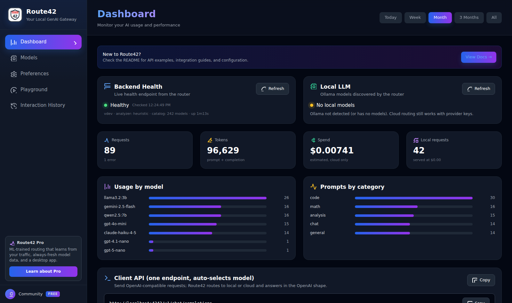
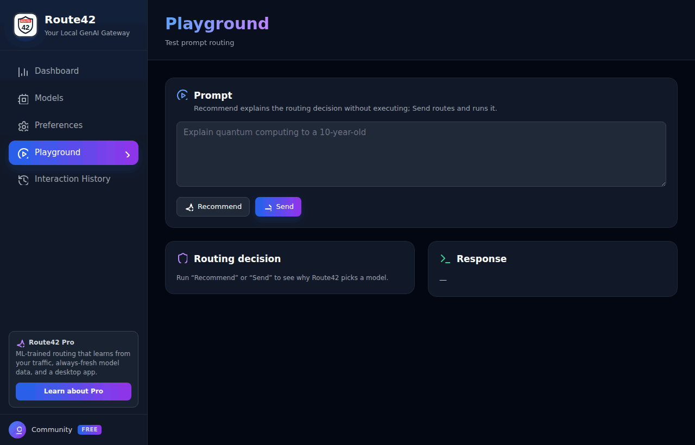
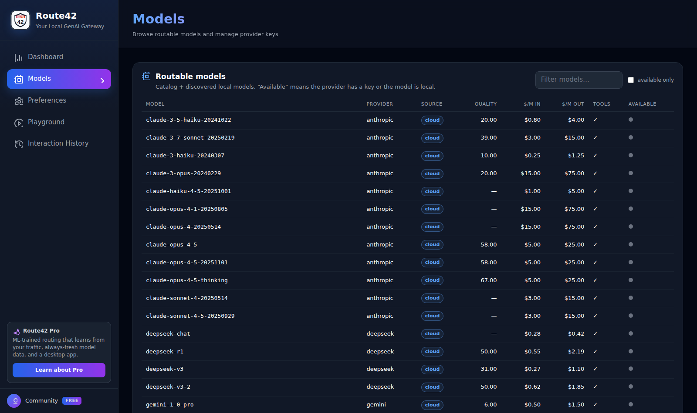
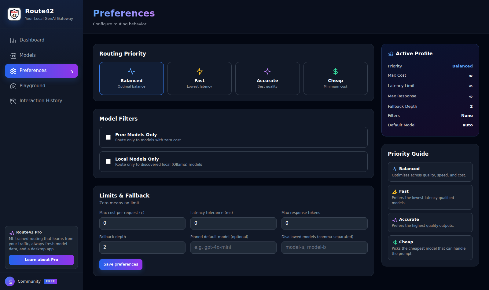
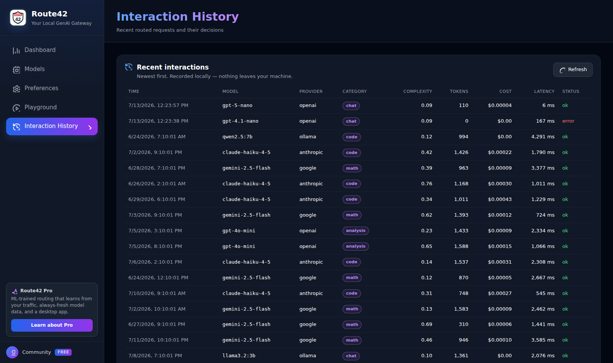
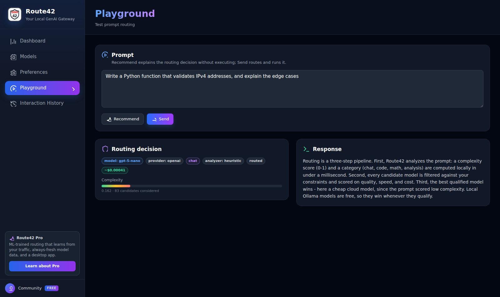

# Route42 Community Edition

**Local-first LLM router: the right model for every prompt — your GPU first, cloud only when it's worth it.**

Route42 is an OpenAI-compatible gateway that analyzes each prompt and routes it to the optimal model across local (Ollama) and cloud providers (OpenAI, Anthropic, Google, Mistral, Groq, DeepSeek, and more). Simple prompts run on your own hardware for $0.00; complex ones go to the cheapest cloud model that can actually handle them.

Runs entirely on your machine. No telemetry, no account required, your API keys never leave your device.

```
Your app ──▶ localhost:4242 ──▶ [ analyze → score → rank ] ──▶ Ollama (free)
             (OpenAI-compatible)                          └──▶ Cloud API (when needed)
```

## Why Route42 instead of a plain gateway?

Gateways like LiteLLM or Bifrost unify provider APIs and load-balance — but they don't decide *which model deserves this prompt*. Route42 adds the decision layer:

- **Complexity-aware routing** — every prompt gets a complexity score; "what's 2+2" never hits a premium model.
- **Cost arbitrage** — quality/speed/cost composite scoring picks the cheapest *qualified* model.
- **Local-first** — installed Ollama models are auto-discovered and treated as first-class, zero-cost candidates.
- **Explainable** — routing decisions are deterministic and inspectable; the response tells you *why* a model was chosen.

## Features

### Routing engine
- **OpenAI-compatible API** at `localhost:4242` — streaming (SSE) and non-streaming, works with any OpenAI SDK, Claude Code, Cursor, Continue.dev, or anything that speaks `/chat/completions`.
- **Prompt analysis with pluggable analyzers** (see below): complexity score (0–1) + category (chat / code / math / analysis / general).
- **Multi-criteria ranking** — composite quality/speed/cost scoring with weights adjusted by complexity and your preference mode (category drives the quality floor).
- **Preference modes** — `balanced`, `fast`, `cheap`, `accurate`.
- **Hard constraints** — max cost per request, latency tolerance, disallowed models, only-local, only-free, max response tokens, pinned default model.
- **Fallback chains** — configurable fallback depth when the selected model or provider fails.
- **Tool-calling-aware routing** — prompts that need function calling are only routed to models with verified tool support.

### Prompt analyzers (pick per deployment)
| Analyzer | Cost | How it works |
|---|---|---|
| `heuristic` (default) | free, <1ms | Deterministic signal scoring: code blocks, requirement density, reasoning cues, question fan-out, context depth. Fully explainable — per-signal scores are returned with every decision. |
| `llm` (optional) | free, ~50–200ms | Uses a small local model via Ollama (e.g. `qwen2.5:0.5b`) to classify category and complexity with few-shot prompting. Smarter on ambiguous prompts, still 100% local and private. Falls back to `heuristic` if Ollama is unavailable. |
| `hybrid` (optional) | free, <1ms + LLM latency | Blends heuristic signals with LLM judgment: heuristic always runs (cheap, never fails), LLM refines complexity via weighted blend and overrides category only when heuristic had low confidence. Combines explainability with LLM's strength on ambiguous prompts. |

A fourth mode — analyzers trained on real routing outcomes — ships with [Route42 Pro](https://route42.app).

### Providers & models
- **Cloud providers:** OpenAI, Anthropic, Google Gemini, Mistral, Groq, DeepSeek, Alibaba, Moonshot, NVIDIA, OpenRouter.
- **Local:** automatic Ollama model discovery; local models score as $0 cost with no network latency.
- **Model catalog:** versioned snapshot of models with quality/speed/price metrics, normalized across providers. Community PRs welcome.

### Privacy & operations
- **Bring your own keys** — per-provider API keys stored encrypted in a local SQLite database.
- **No telemetry** — nothing leaves your machine except the LLM calls you route.
- **Interaction log & stats** — every request records the chosen model, rationale, cost, and latency; browse usage and spend locally.
- **Web console** — a built-in dashboard at `http://localhost:4242` for usage, models, keys, preferences, and a routing playground. Optional: everything works headless via the CLI and API (`server.ui: false` turns it off).
- **Single binary** — Go backend, SQLite storage, embedded UI, no external services.

## Install

**Download a binary** from the [latest release](https://github.com/krugis/route42app/releases/latest) — a single static file for Windows, macOS, and Linux, no dependencies:

```bash
# Linux (amd64; see the release page for arm64 and macOS)
curl -LO https://github.com/krugis/route42app/releases/download/v0.2.0/route42_0.2.0_linux_amd64.tar.gz
tar -xzf route42_0.2.0_linux_amd64.tar.gz
sudo mv route42 /usr/local/bin/
```

On Windows, download the `.zip`, unpack, and put `route42.exe` somewhere on your `PATH`. Verify downloads against the release's `SHA256SUMS`. The web console is built into the binary — there's nothing extra to install.

**Or install with Go 1.25+:**

```bash
go install github.com/krugis/route42app/cmd/route42@latest
```

**Or build from source:**

```bash
git clone https://github.com/krugis/route42app
cd route42app
go build -o route42 ./cmd/route42
```

## Quick start

```bash
# 1. Run
route42 serve              # gateway + web console on localhost:4242

# 2. Add a provider key (or none — Ollama-only works fine)
curl -X POST localhost:4242/api/keys -d '{"provider":"openai","api_key":"sk-..."}'

# 3. Chat — Route42 picks the model
curl localhost:4242/api/chat/completions \
  -H "Content-Type: application/json" \
  -d '{"messages":[{"role":"user","content":"Explain quantum computing to a 10-year-old"}]}'
```

Point any OpenAI client at `http://localhost:4242` and it just works.

## Two ways to run it

`route42 serve` is the whole product — the routing gateway, the CLI, and the web console are one binary. You choose how much of it you use.

### With the web console (default)

```bash
route42 serve
```

Then open **http://localhost:4242** in a browser. You get the gateway *and* a point-and-click console for keys, preferences, usage, and a routing playground — plus the OpenAI-compatible API on the same port. Nothing else to install; the console is embedded in the binary. This is the default, so no flags are needed. Jump to [Web console](#web-console) for a tour.

### Headless — CLI and API only (no browser)

Prefer a pure gateway with no UI (servers, containers, CI)? Turn the console off:

```bash
route42 serve                 # then, either:
ROUTE42_UI=false route42 serve # env var — disables the console for this run
```

Or set it permanently in `route42.yaml`:

```yaml
server:
  ui: false
```

With the console off, `route42 serve` still exposes the full OpenAI-compatible API, and everything the console does is available from the terminal:

```bash
route42 keys add openai sk-...            # manage provider keys
route42 prefs set priority=cheap          # configure routing
route42 analyze "explain regex backrefs"  # inspect a routing decision
curl localhost:4242/api/chat/completions \
  -H "Content-Type: application/json" \
  -d '{"messages":[{"role":"user","content":"hi"}]}'   # route a prompt
```

Both modes are the same gateway — the `ui` flag only controls whether `/` serves the console. The [CLI](#cli) and [API reference](#api-reference) below cover the headless path in full.

## Web console

`route42 serve` also hosts a small web console at [http://localhost:4242](http://localhost:4242) — the same look as the Route42 Pro desktop app, embedded in the binary (plain HTML/CSS/JS, no build step, no external assets):



### Watch a routing decision happen

Type a prompt in the **Playground**: *Recommend* shows the decision Route42 would make — complexity score, detected category, and every candidate ranked by quality/speed/cost — and *Send* routes the prompt and streams the answer:



Every page maps to the public API, so anything you see in the console you can also script:

- **Dashboard** — gateway health, discovered local models, usage/spend/tokens over time, per-model and per-category breakdowns, copy-paste client snippets.
- **Models** — the full routable catalog with quality/price metrics and availability, plus provider key management.
- **Preferences** — routing priority, model filters, cost/latency limits, and fallback, with a live profile summary.
- **Playground** — type a prompt, see the full routing decision (complexity, category, ranked candidates), and run it with streaming output.
- **Interaction History** — the local request log: model, category, tokens, cost, latency.

<details>
<summary><strong>More screenshots</strong> — Models, Preferences, Interaction History</summary>









</details>

The console is optional. The gateway is fully operable headless via the CLI and HTTP API; set `server.ui: false` (or `ROUTE42_UI=false`) to disable it. If `server.api_token` is set, the console prompts for the token and sends it on its API calls.

## CLI

The `route42` binary is both the gateway and a management tool:

```bash
route42 serve                          # start the gateway (default)
route42 models list                    # list routable models (catalog + local Ollama)
route42 keys add openai sk-...         # store a provider API key (encrypted)
route42 keys list                      # list configured providers (keys masked)
route42 keys remove openai             # delete a stored key
route42 prefs get                      # print current routing preferences
route42 prefs set priority=cheap       # update one or more preference fields
route42 prefs set --json '{"priority":"fast","fallback_depth":3}'
route42 analyze "explain regex backreferences"   # print the prompt analysis
route42 version
```

`prefs set` accepts `field=value` pairs (or `--json '{...}'` to replace the whole record). Fields: `priority`, `max_cost_cents`, `latency_tolerance_ms`, `only_free`, `only_local`, `max_response_tokens`, `default_model`, `fallback_depth`, `disallowed_models` (comma-separated).

### `analyze` — the routing explainer

`route42 analyze "<prompt>"` runs the configured analyzer and prints the complexity score, detected category, and the per-signal contributions that produced them. It's the fastest way to see *why* Route42 would route a prompt the way it does:

```bash
$ route42 analyze "def fib(n): return n if n<2 else fib(n-1)+fib(n-2)"
{
  "complexity": 0.086,
  "category": "chat",
  "signals": {
    "category.chat.short": 1.5,
    "complexity.length": 0.061,
    "complexity.vocabulary": 0.026
  },
  "analyzer": "heuristic"
}
```

For a visual version of the same pipeline, see the [Playground demo](#watch-a-routing-decision-happen) in the web console.

## How routing decisions are made

1. **Analyze** — the configured analyzer scores complexity (0–1) and detects the category.
2. **Filter** — remove models that fail your constraints (cost cap, tool support, quality floor for the detected complexity).
3. **Score** — each candidate gets a composite score from quality, speed, and cost metrics, weighted by your preference mode and the prompt's complexity.
4. **Select & fall back** — highest score wins; on a retryable provider failure (429/5xx/timeout), the next candidate in the chain takes over up to your `fallback_depth`.

Every response includes the selected model and the analyzer's signal breakdown, so you can always answer "why did it pick that model?"

### Analyzer configuration

```yaml
analyzer:
  mode: heuristic          # heuristic | llm | hybrid
  llm:
    model: qwen2.5:0.5b    # any small Ollama model (required for llm and hybrid)
    timeout_ms: 1500       # falls back to heuristic on timeout
    hybrid_weight: 0.5     # 0..1, blend weight for hybrid mode (default 0.5)
```

## Integration

Point any OpenAI-compatible client at `http://localhost:4242`. Route42 speaks the OpenAI Chat Completions API on both `/api/chat/completions` and the `/v1/chat/completions` alias.

### Python (OpenAI SDK)

```python
from openai import OpenAI

client = OpenAI(base_url="http://localhost:4242/v1", api_key="unused")  # no key needed by default

resp = client.chat.completions.create(
    model="auto",  # "auto" or omit → Route42 routes; a specific model pins
    messages=[{"role": "user", "content": "Explain quantum computing to a 10-year-old"}],
)
print(resp.choices[0].message.content)
# The routing decision is on the non-breaking x_route42 extension:
print(resp.model)            # the model Route42 picked
print(resp.model_dump()["x_route42"]["complexity"])
```

Streaming works the same way:

```python
stream = client.chat.completions.create(
    model="auto",
    messages=[{"role": "user", "content": "Write a haiku about routing"}],
    stream=True,
)
for chunk in stream:
    if chunk.choices and chunk.choices[0].delta.content:
        print(chunk.choices[0].delta.content, end="")
```

### JavaScript / TypeScript (OpenAI SDK)

```ts
import OpenAI from "openai";

const client = new OpenAI({ baseURL: "http://localhost:4242/v1", apiKey: "unused" });

const resp = await client.chat.completions.create({
  model: "auto",
  messages: [{ role: "user", content: "Explain quantum computing to a 10-year-old" }],
});
console.log(resp.choices[0].message.content);
```

### Continue.dev

Add Route42 as a model provider in `~/.continue/config.json`:

```json
{
  "models": [{
    "title": "Route42",
    "provider": "openai",
    "model": "auto",
    "apiBase": "http://localhost:4242/v1",
    "apiKey": "unused"
  }]
}
```

### Any OpenAI client

Use base URL `http://localhost:4242/v1`, any non-empty API key (unless you set `server.api_token`), and `model: "auto"` (or omit it) to let Route42 route. Set a specific model id to pin and bypass routing. The `x_route42` object on each response carries the selected model, complexity, category, and estimated cost.

## API reference

| Method | Path | Description |
|---|---|---|
| `POST` | `/api/chat/completions` *(alias `/v1/chat/completions`)* | OpenAI-compatible chat (stream + non-stream). `model:"auto"`/absent routes; a specific model pins. |
| `POST` | `/api/keys` | Store a provider key (`{"provider","api_key"}`). Values are write-only. |
| `GET` | `/api/keys` | List configured providers (keys masked). |
| `DELETE` | `/api/keys?provider=...` | Delete a stored key. |
| `GET` | `/api/prefs` | Get routing preferences. |
| `PUT` | `/api/prefs` | Replace preferences (validated). |
| `POST` | `/api/recommend` | Ranked candidates + explanation, no execution (`{"messages":[...]}`). |
| `GET` | `/api/stats?days=N` | Usage aggregates (0 = all time). |
| `GET` | `/api/interactions?limit=N` | Recent interaction log entries, newest first (default 50, max 500). |
| `GET` | `/api/models` *(alias `/v1/models`)* | Catalog + local discovery + availability (OpenAI list shape). |
| `GET` | `/health` | Liveness/readiness (always public). |
| `GET` | `/` | Embedded web console (disable with `server.ui: false`). |

Optional auth: set `server.api_token` in config and send `Authorization: Bearer <token>` on `/api/*` routes (`/health` and the console assets stay public).

## Documentation

- [`docs/analyzer.md`](docs/analyzer.md) — how the heuristic analyzer works (signals, weights, categories).
- [`docs/catalog.md`](docs/catalog.md) — catalog schema and how to PR model updates.
- [`docs/config.md`](docs/config.md) — full configuration reference.

## Route42 Pro

Community Edition is complete and stays that way. If you want the routing brain to get smarter over time — ML-trained analyzers, routing that learns from your own traffic, always-fresh model data, and a desktop app — that's [Route42 Pro](https://route42.app).

## License

Apache-2.0. "Route42" name and logo are trademarks of Krugis.
